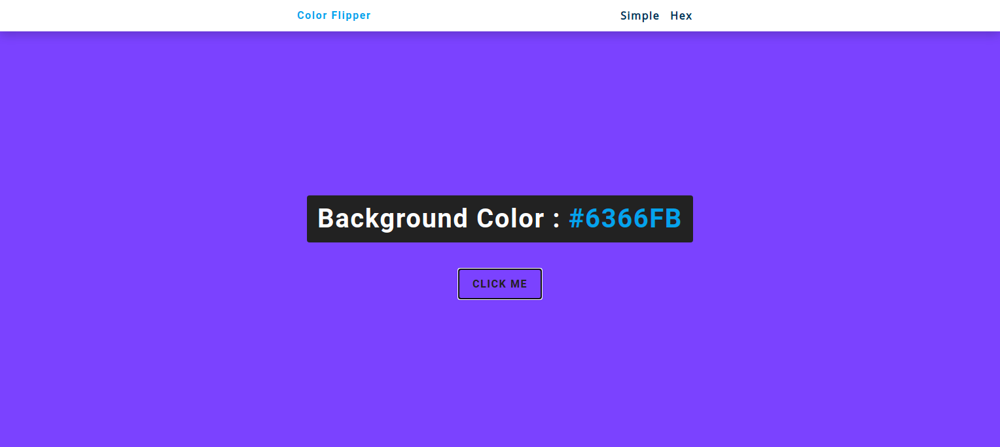

# color_flipper-app

> A color flipper app that changes range of colors upon clicking the button, it also ranges from simple colors to unlimited hex-colors.



- Has 2 pages.
- changes color on clicking of the button.
- has unlimited hex-colors.

## Built With

- Html, CSS, and JavaScript

## Live Demo

[Live Demo Link](https://color-flipper-app.vercel.app/)

## Getting Started

To get a local copy up and running follow these simple example steps.

### Install

You can download the code to your personal computer clonig the repository using the following command

```
git clone https://github.com/diamond-nicholas/color_flipper-app.git

```

You will also have to checkout to the flipper branch and use the command 'git pull' to get the lastest code.

You also need to use the command 'npm install' to install all packages from the project.

### Usage

To run this project you only need to open the index.html file from the folder in which it was saved on your computer in a web browser

You can also start the project on vscode by opening with live server. You can install live server from the extension section on your vscode.

## Authors

👤 **Nicholas Diamond**

- GitHub: [@Diamond](https://github.com/diamond-nicholas)
- LinkedIn: [Diamond Nicholas](https://www.linkedin.com/in/diamond-nicholas/)
- Twitter: [@diamondnich](https://twitter.com/diamondnich)

## 🤝 Contributing

Contributions, issues, and feature requests are welcome!

Feel free to check the [issues page](https://github.com/diamond-nicholas/color_flipper-app/issues).

## Show your support

Give a ⭐️ if you like this project!

## 📝 License

This project is [MIT](./LICENSE) licensed.
